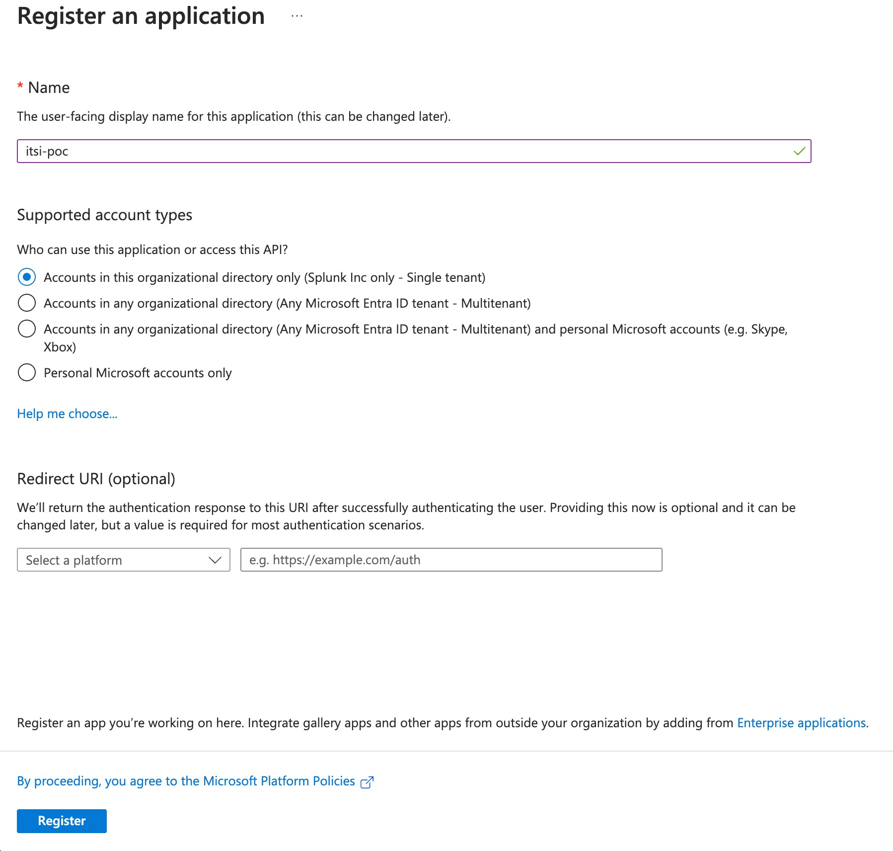
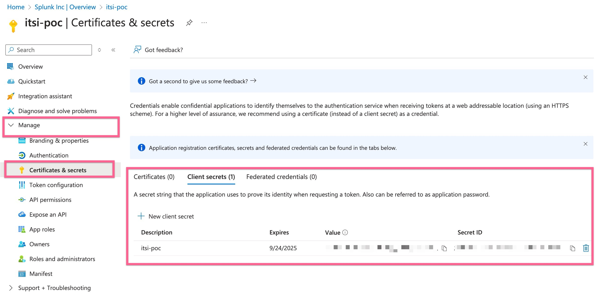
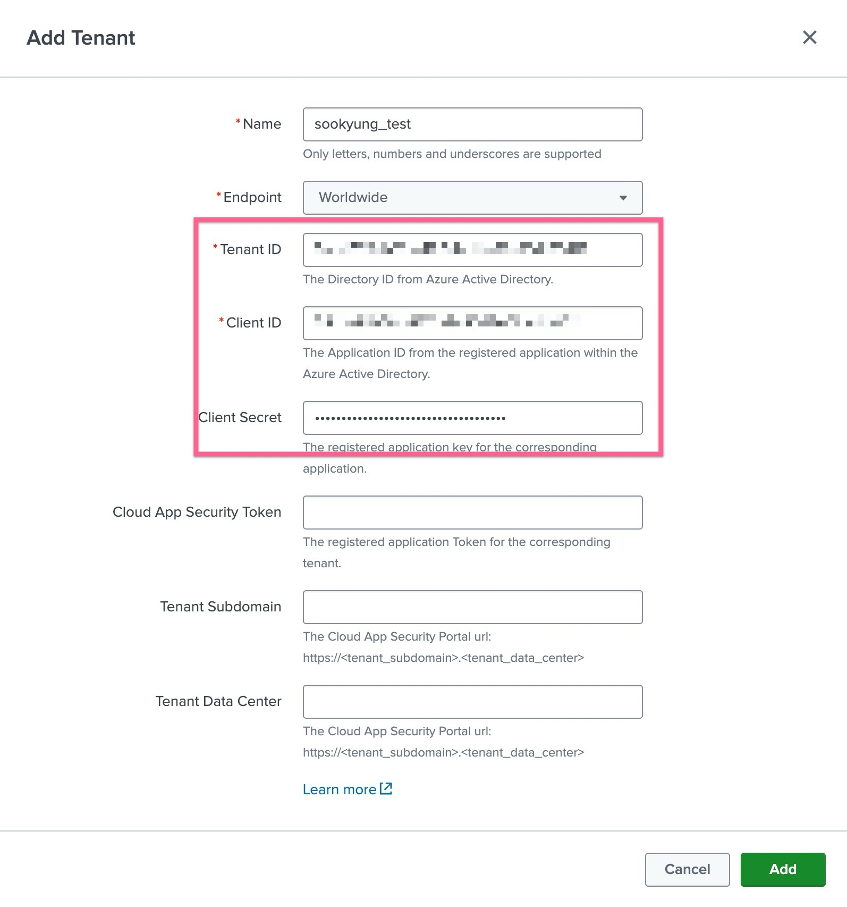
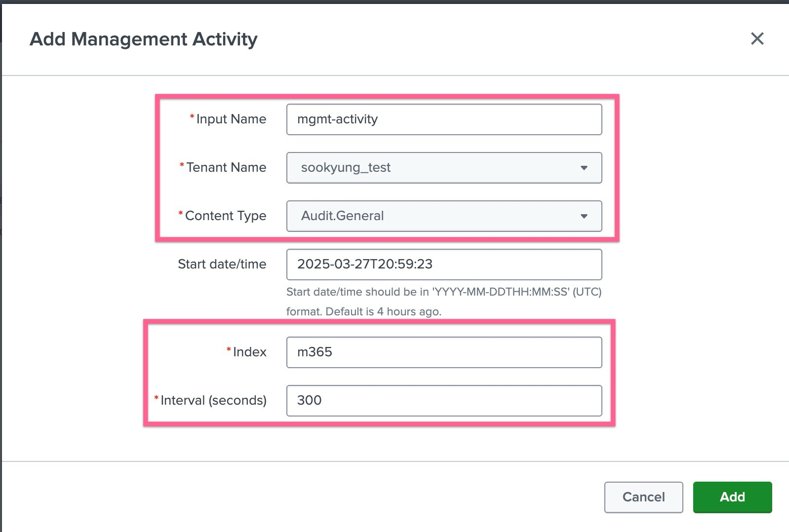
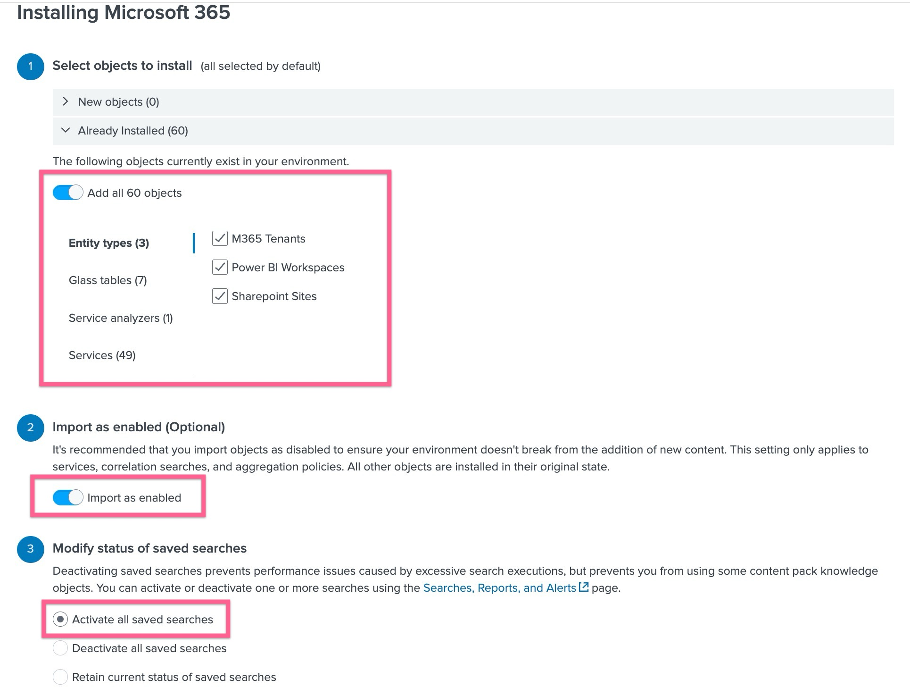

**Table of Contents**

- [Requirements](#requirements)
- [1. Microsoft Data Input 만들기 (Core)](#1-microsoft-data-input-만들기-core)
  - [1-1. Azure AD에서 통합 애플리케이션 구성](#1-1-azure-ad에서-통합-애플리케이션-구성)
  - [1-2. Tenant 연동하기](#1-2-tenant-연동하기)
  - [1-3. Input 생성하기](#1-3-input-생성하기)
- [2. M365 Content Pack 구성하기 (ITSI)](#2-m365-content-pack-구성하기-itsi)
  - [2-1. M365 콘텐츠팩 설치하기](#2-1-m365-콘텐츠팩-설치하기)
- [참조](#참조)

# Requirements

- [ ] Microsoft Office 365 Add-on
- [ ] Microsoft Entra ID (register application)
- [ ] API 조회 권한 및 secret
- [ ] Splunk Cloud / Enterprise 가 Microsoft 와 443 통신이 가능해야 합니다
- [ ] Microsoft Azure의 Admin 권한이 필요합니다 - API 조회 권한 부여 시 Application 타입의 권한은 어드민이 직접 부여하거나, 어드민의 승인이 받아야 부여가 완료됩니다
- [ ] sankey diagrams and punchcard visualizations - Custom Visualization을 위해 추가 시각화 앱이 필요합니다

# 1. Microsoft Data Input 만들기 (Core)

## 1-1. Azure AD에서 통합 애플리케이션 구성

Azure 화면에서 Microsoft Entra ID 메뉴로 이동하여 [Register an Application] 버튼을 눌러 생성을 진행합니다

이 때 생성 된 아래의 두 ID를 백업 해 둡니다

- 디렉토리 ID (테넌트 ID)
- 애플리케이션 ID (클라이언트 ID)

그런다음 사이드바에서 **Manage > API Permission** 화면으로 가서 해당 애플리케이션에 API 를 조회 할 수 있는 권한을 부여합니다.

필요한 권한은 아래 표와 같습니다

| API/Permissions name         | API Technology Name             |
| ---------------------------- | ------------------------------- |
| ServiceHealth.Read.All       | Microsoft Graph                 |
| ServiceMessage.Read.All      | Microsoft Graph                 |
| ActivityFeed.Read            | Microsoft Office 365 Management |
| AuditLog.Read.All            | Microsoft Graph                 |
| Reports.Read.All             | Microsoft Graph                 |
| ReportingWebService.Read.All | Microsoft Reporting WebService  |

**저장** 을 눌러 API 권한 부여를 완료합니다.

마지막으로 **Manage > Certificates & secrets** 화면에서 연동을 위한 시크릿을 생성하고 백업합니다

## 1-2. Tenant 연동하기

Splunk의 Microsoft Office 365 Add-on 에서 작업을 지속합니다.
**Configurations > Tenant** 탭에서 [Add] 버튼을 클릭합니다.
아래와 같은 내용을 채워넣고 생성을 완료합니다

- Name : 연결 이름을 지정합니다
- Endpoint : Worldwide 선택
- Tenant ID : 1-1 에서 백업한 디렉토리 ID를 입력합니다
- Client ID : 1-1 에서 백업한 Application ID를 입력합니다
- Client Secret : 1-1 에서 백업한 secret 의 Value를 입력합니다

## 1-3. Input 생성하기

Microsoft Office 365 Add-on 에서 Input 탭으로 이동합니다.
**[Create New Inputs]** 를 클릭하여 나오는 드롭다운 메뉴에서 수집하고싶은 데이터 유형을 선택합니다. 본 가이드에서는 **Management Activity** 를 선택하겠습니다

- Input Name : 이름을 지정합니다
- Tenant Name : 앞서 생성한 tenant 를 지정합니다
- Content Type : 수집할 데이터의 타입을 지정합니다
- Index : 데이터를 수집할 인덱스를 지정합니다

[Add] 를 눌러 Input 생성을 완료합니다

# 2. M365 Content Pack 구성하기 (ITSI)

## 2-1. M365 콘텐츠팩 설치하기

**ITSI > Data Integration** 메뉴에서 Contents Library 탭으로 이동하여 Microsoft 365 타일을 찾아 클릭합니다.
다음 창에서 [Preceed] 버튼을 눌러 콘텐츠팩 설치를 지속합니다

설치 옵션 화면에서 아래 부분이 모두 선택이 되었는지 확인합니다.

- [ ] 콘텐츠팩의 모든 요소를 선택합니다
- [ ] Import as enabled 를 활성화 시킵니다
- [ ] Activate All saved search 를 선택합니다

# 참조

| 설명                                                     | 링크                                                                                   |
| -------------------------------------------------------- | -------------------------------------------------------------------------------------- |
| Install the Splunk Add-on for Microsoft Office 365       | https://splunk.github.io/splunk-add-on-for-microsoft-office-365/Install/               |
|                                                          | https://splunk.github.io/splunk-add-on-for-microsoft-office-365/ConfigureAppinAzureAD/ |
| Install and configure the Content Pack for Microsoft 365 | https://docs.splunk.com/Documentation/CPM365/1.5.0/CP/Install                          |
| KPI reference for the Content Pack for Microsoft 365     | https://docs.splunk.com/Documentation/CPM365/1.5.0/CP/KPIReference                     |
